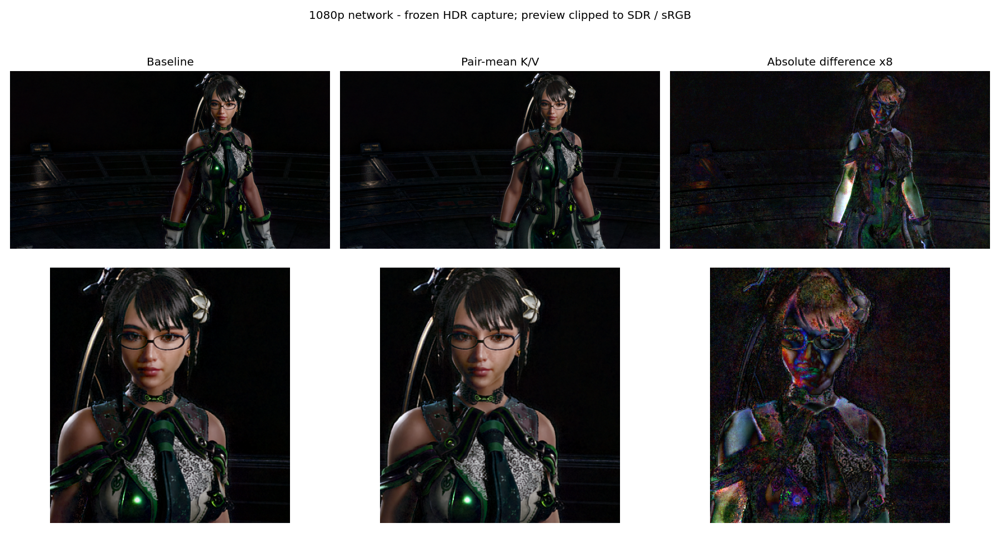

# ViT attention K/V pair-centroid approximation — first experiment

2026-09-20, RX 9070 XT. Only `vit_attention_fused_body` in an isolated copy of `hip/deep_fast.hip` changes. Original source SHA256: `9f4e00a19fc9985b03d83cf410026fd3fd40b248eacc873577ab5edf63e7e78c`. No production source/kernel or game DLL replacement.

For adjacent keys/values use K'=(K[2j]+K[2j+1])/2 and V'=(V[2j]+V[2j+1])/2, quantized through the existing FP8 pack. Q remains unchanged. All representative groups have multiplicity two, which cancels in the normalized numerator/denominator. This does NOT make the approximation exact: applying the exponential-like mapping to the mean score differs from summing two individual weights, and merging V loses its correlation with each score. Retains the model's original exponent bit mapping and output rounding. Invalid lanes in the 400-token tier's half-length tail contribute zero weight; reads are bounded.

This is a simple, unconditional summary approximation inspired by the broad Sol-Attn idea, not a port of Sol-Attn's adaptive routing. Pairing follows token order; it is not guaranteed to preserve 2D row boundaries. In particular the odd-width 900-tier token grid needs better spatial grouping in a subsequent design.

## Timing

`benchmark_c256frag_production.exe`, production flags, graph off, fixed 1296×720 RGBA16F captured input, network height forced to 900/1080. Includes NativeGameFrame conversion/inference/bridge/synchronization, excludes the game's rendering. ABBA order, 160 frames/run, discard 32. Baseline endpoint hashes match the existing goldens; the two candidate hashes match each other.

| Network | Baseline ms | Pair means ms | Saved ms | Reduction |
|---|---:|---:|---:|---:|
| 900 | 13.3995 | 13.2070 | 0.1925 | 1.44% |
| 1080 | 19.54175 | 18.85725 | 0.6845 | 3.50% |

Baseline endpoint drift: 0.025/0.0595ms. These are replay results, not demonstrated game FPS improvements.

A second `none → duplicate vit_attention → none` probe measured extra-call marginal cost: baseline/pair 0.419/0.43475ms at 900, 1.12525/0.73375ms at 1080. This does not reproduce the full-frame saving and is NOT a precise kernel-time breakdown. In particular the 900 experiment does not prove the attention body alone is faster. Changed downstream values/cache behavior also affect total processing. Isolated device-event timing on matched real QKV would be needed to attribute the complete saving.

## Output difference

Two tiers × captured image / synthetic high-dynamic-range pattern / synthetic near-black pattern × baseline/candidate, 12 frozen-input frames each: all 144 outputs finite, no differences from the first output within each run. This is frozen-input determinism, not a moving-scene or temporal-stability test.

Display metrics below clip linear HDR RGB to [0,1], then apply the sRGB transfer function. They compare the candidate to the baseline, not against a visual ground truth. Raw HDR metrics are retained in summary.json.

| Pattern | 900 display MAE /255 | 900 PSNR dB | 1080 display MAE /255 | 1080 PSNR dB |
|---|---:|---:|---:|---:|
| Captured scene | 2.630 | 35.79 | 2.623 | 35.22 |
| Synthetic HDR | 2.347 | 38.91 | 5.266 | 32.52 |
| Near-black | 0.594 | 48.73 | 1.008 | 45.05 |

The captured scene's raw relative RMSE is 11.97%/13.30%; maximum absolute HDR component deviation 0.1546/0.2437. Near-black relative errors are large (81.9%/61.8%) despite small absolute/display error; do not hide this behind the PSNR. Differences concentrate around the character and highlights in the preview.

## Outcome

Feasible as an inference-time approximation with unchanged trained weights; first whole-pipeline measurement is faster, but savings are modest and output is meaningfully altered. Keep experimental. Next investigate similarity/spatially aware grouping that preserves distinct keys/values, with preprocessing overhead included; moving frames and scene changes must be tested before deployment.

Candidate COMGR build: gfx1200 `3ae02111560189af28223b543f5d9725d8a2a92ad52835711b54d13c297da303`; gfx1201 `6a7611fe4c3061b9f691b2f1c3dd5dc01cbab2e4b662cdc016506baac427d2ba`. Only gfx1201 ran on actual hardware. Source generation, build, quality and timing tools: `Development/HIP/experiments/vit-kv-pair/`. Raw frame outputs remain in `D:\DLSSNR-Lab\hip-backend\profile1080\vitpair-*`; candidates in `D:\DLSSNR-Lab\vit-kv-pair-build` and `hip-backend\vit-kv-pair-modules`. Never package those modules as production.
